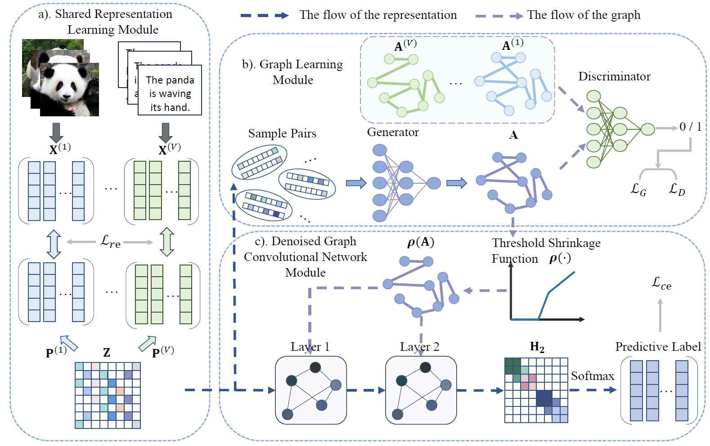

# Generative Essential Graph Convolutional Network for Multi-view Semi-supervised Classification

====
This is the Pytorch implementation of GEGCN proposed in our paper:


## Requirement

  * Python == 3.9.12
  * PyTorch == 1.11.0
  * Numpy == 1.21.5
  * Scikit-learn == 1.1.0
  * Scipy == 1.8.0
  * Texttable == 1.6.4
  * Tqdm == 4.64.0

## Usage

```
python main.py
```

  * --device: gpu number or 'cpu'.
  * --path: path of datasets.
  * --dataset: name of datasets.
  * --seed: random seed.
  * --fix_seed: fix the seed or not.
  * --n_repeated: number of repeat times.
  * --lr: learning rate.
  * --weight_decay: weight decay.
  * --ratio: label ratio.
  * --num_epoch: number of training epochs.
  * --knns: hyperparameter of the number of neighbors $k$.
  * --theta: Initialize the  learnable parameter $\theta_1$ and $\theta_2$.

All the configs are set as default, so you only need to set dataset.
For example:

 ```
 python train_and_test.py --dataset HW
 ```

